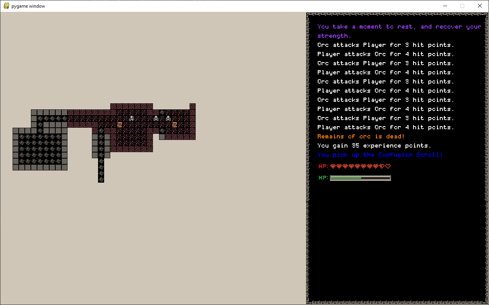
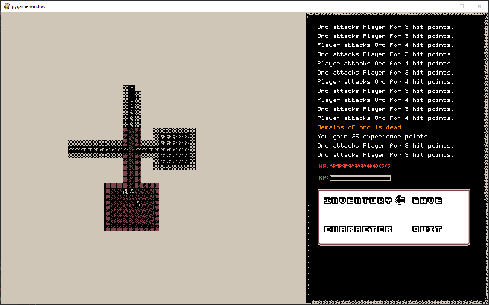
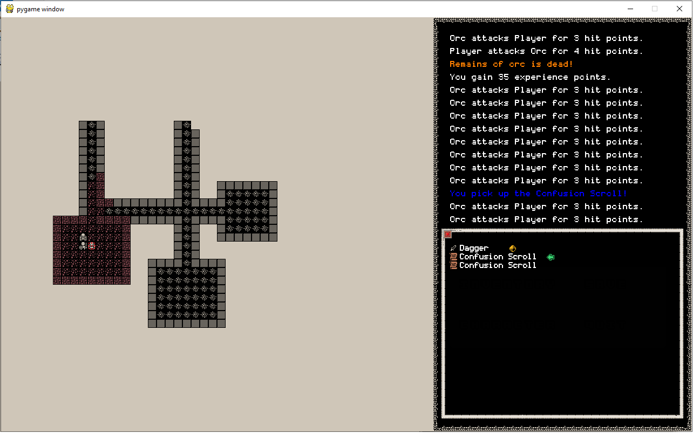

# Depths
Roguelike game written in Python with the use of the pygame and libtcod libraries.
## Table of Contents
* [General info](#general-info)
* [Features](#features)
* [Setup](#setup)
* [Screenshots](#screenshots)
* [Acknowledgements](#acknowledgements)
### General info
Depths is a classic roguelike game where the player takes on the role of an adventurer exploring a procedurally generated dungeon,
slaying  enemies and collecting loot in the process.
- Language: Python
- Libraries: pygame for rendering, libtcod for essential roguelike functionality like FOV calculations.
### Features
- Procedurally generated dungeons
- Difficulty increases with duration of playthrough
- Item and equipment systems
- Tile-based rendering
- Object-Oriented and Component based architectures
- A* Pathfinding algorithm for enemies
### Setup
Clone the repository, install pygame and libtcod if you do not have them and then run main.
### Screenshots

### Acknowledgements
Textures are from 
and this is the  I used to get started with the project.
